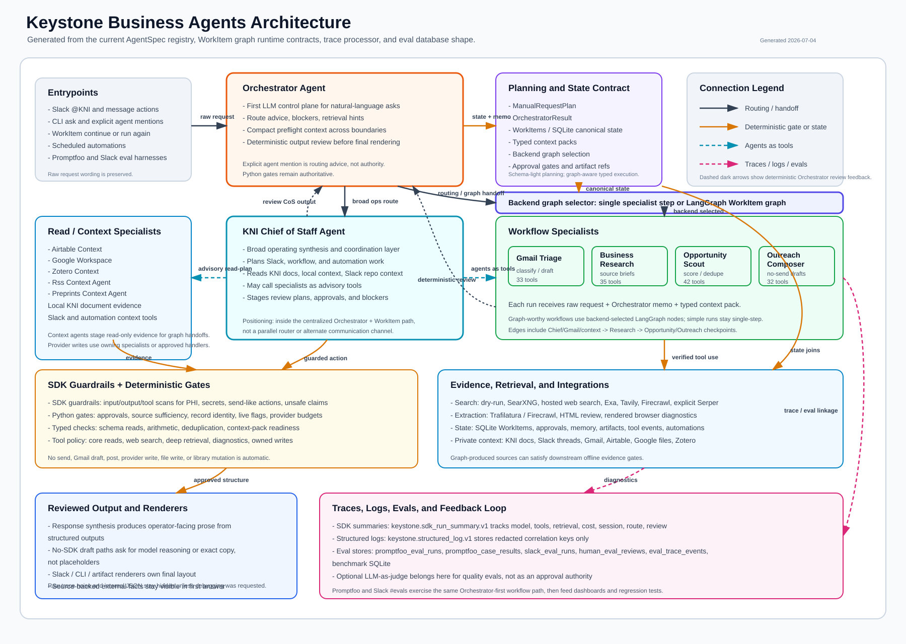
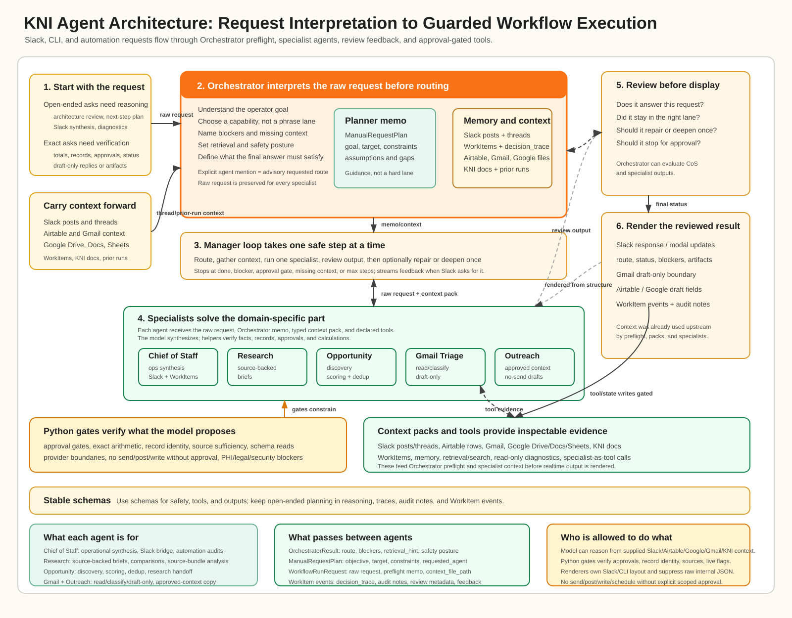
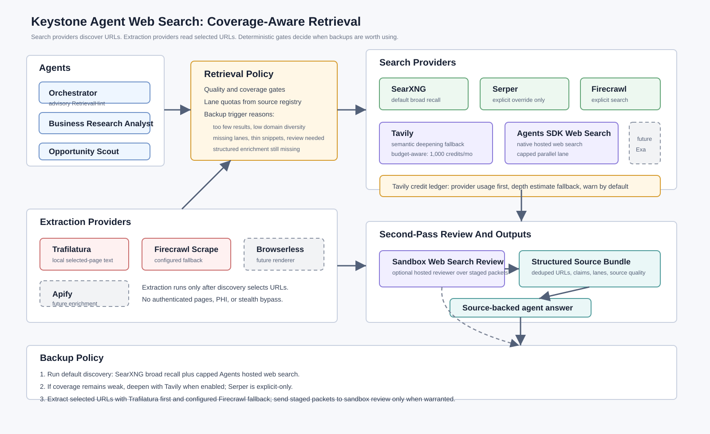
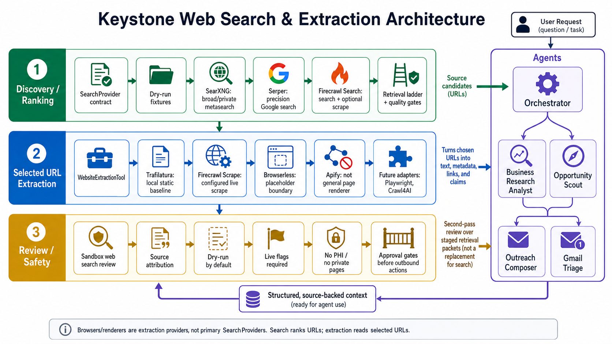

# Visual Context

This folder collects repo-local visuals that explain Keystone architecture for operators,
reviewers, and future agent context packs.

## Current Agent Architecture



This generated diagram is the current architecture visual. Regenerate it after
agent registry, workflow, trace, or eval structure changes:

```bash
.venv/bin/python scripts/render_agent_architecture_diagram.py
```

The visual keeps Orchestrator above the execution plane as the first request
control plane and output review layer. Chief of Staff sits below it as the
cross-functional operating synthesis layer: broad Slack, workflow, automation,
and KNI context requests can route there, and Chief of Staff may call workflow
and context specialists as advisory tools. The edge colors distinguish
routing/handoffs, deterministic gate/state flows, agents-as-tools calls, and
trace/log/eval linkages.

## Legacy Orchestrator-First Model Architecture



This older visual remains useful for the narrower Orchestrator-first routing
model, but the generated current diagram above includes Chief of Staff,
read-only context agents, traces, logs, and evals.

## Web Search And Extraction



The diagram shows the intended boundary:

- SearXNG and capped Agents SDK hosted web search handle default live discovery
- Serper is explicit-only; Tavily can deepen coverage when configured
- Tavily usage is tracked against the local monthly credit budget
- extraction providers read selected URLs after discovery
- sandbox web search review is a second-pass review over staged retrieval packets
- source-backed structured context flows back to the specialist agents

Legacy visual:


