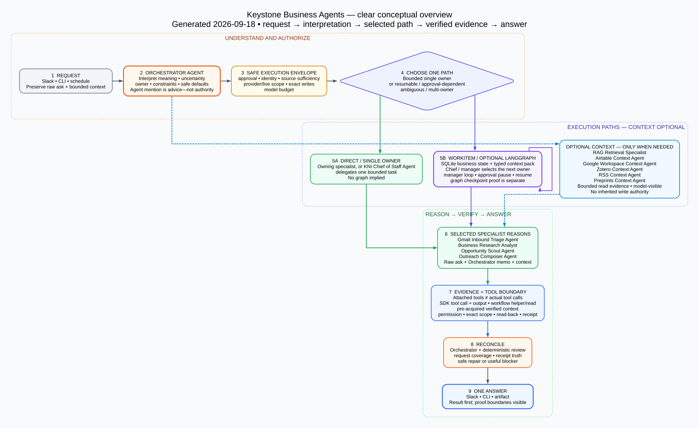
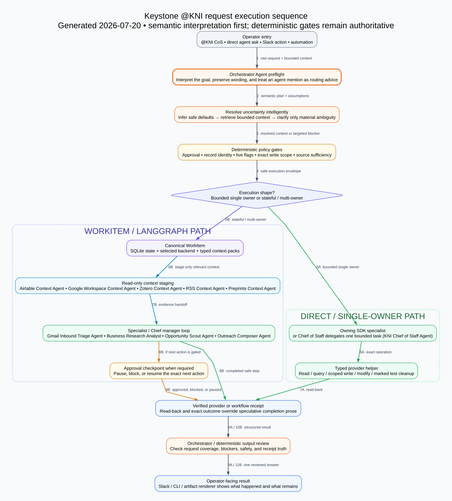
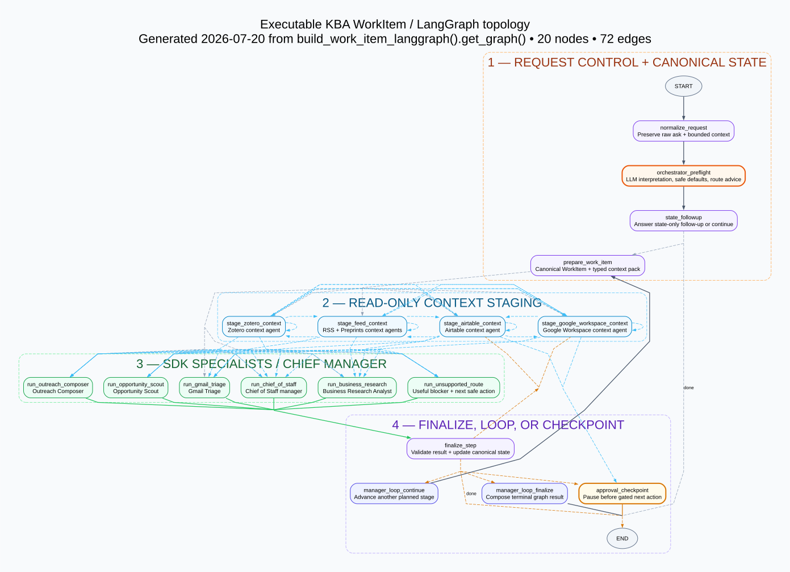

# Visual Context

This folder collects repo-local visuals that explain Keystone architecture for operators,
reviewers, and future agent context packs.

## Start With The Integrated Map

The integrated view connects ownership, sequence, read/context specialists,
direct execution, the WorkItem graph loop, providers, verified receipts, and
rendering in one canvas. It uses stacked numbered layers rather than a
component-only map: the orange control plane interprets the request, the blue
context lane shows each read/context specialist separately, and the execution
shape splits into direct and graph branches before rejoining at a verified
receipt. The three narrower views remain useful when one question needs more
detail.



[DOT source](assets/kba-integrated-agent-architecture.dot)

Follow the numbered arrows from the control plane into either execution branch.
Steps `6A–10A` are the bounded single-owner path. Steps `6B–12B` are the
stateful or multi-owner path. The blue read/context lane can supply bounded
evidence to either path without becoming a separate user-facing route. The graph inset
contains all 20 compiled runtime node names grouped into the real control,
context-stage, specialist, finalize, manager-loop, approval, and terminal
phases; its 72 exact conditional edges remain in the topology detail view.

Choose a detail view when needed:

1. **What are the major system components and ownership boundaries?** Use the current architecture
   overview.
2. **In what order does one natural-language ask execute?** Use the numbered
   request sequence.
3. **What nodes and edges can the stateful runtime actually traverse?** Use the
   executable WorkItem / LangGraph topology.

## 1. System Component Overview


This generated overview shows ownership and system boundaries. It is not the
execution sequence or the literal LangGraph topology. Regenerate it after agent
registry, workflow, trace, or eval structure changes:

```bash
.venv/bin/python scripts/render_agent_architecture_diagram.py
```

The visual keeps Orchestrator above the execution plane as the first request
control plane and output review layer. Chief of Staff sits below it as the
default time-saving operator-facing manager: it can delegate bounded work to
the owning specialist, create a durable WorkItem handoff for stateful or
multi-agent work, or consult workflow and context specialists as advisory
tools. The edge colors distinguish routing/handoffs, deterministic gate/state
flows, agents-as-tools calls, and trace/log/eval linkages.

For an explicitly marked, bounded provider lifecycle, the LLM/Orchestrator
still interprets the natural-language ask and selects the owning specialist.
After that selection, execution binds to the owner's typed lifecycle helper so
create/read-back/update/read-back/cleanup is not left to optional model tool
selection. Stateful multi-owner work continues through a WorkItem graph.

This is the KBA core contract, not a claim that every external adapter already
implements it perfectly. Entrypoint adapters should preserve the raw request
and bounded context without choosing the business owner. Compatibility
pre-routes in the sibling Slack bridge are a migration boundary and must be
checked against this contract when a natural-language Slack ask behaves
differently from the equivalent CLI ask.

## 2. Numbered Request Execution Sequence



[DOT source](assets/kba-request-execution-sequence.dot)

This is the clearest operator-facing flow. Every natural-language entrypoint,
including a direct agent mention and the usual `@KNI CoS` front door, reaches
Orchestrator interpretation first. The system then infers safe defaults,
retrieves bounded context when useful, and asks a question only for material
ambiguity. Deterministic gates establish the safe execution envelope; they do
not replace the LLM with phrase-specific routing.

The execution-shape decision is separate from semantic ownership:

- A bounded single-owner ask uses the owning SDK specialist, or Chief of Staff
  delegates one bounded task, followed by the typed provider helper and
  read-back.
- A stateful or multi-owner ask uses the canonical WorkItem and optional
  LangGraph runtime, stages only relevant read-only context, and can loop across
  specialists or pause at an approval checkpoint.

Both paths converge on a verified receipt, output review, and one
operator-facing Slack or CLI answer.

## 3. Executable WorkItem / LangGraph Topology



[DOT source](assets/kba-workitem-langgraph-topology.dot)

This view contains every node and edge returned by
`build_work_item_langgraph().get_graph()`. It makes the previously hidden graph
explicit: request normalization, Orchestrator preflight, state follow-up,
WorkItem preparation, four context-staging nodes, six execution branches,
finalization, the manager loop, and the approval checkpoint.

The context nodes visibly realize all five registered read/context specialists:
the combined feed stage owns RSS and Preprints, followed by the Zotero,
Airtable, and Google Workspace stages. Dashed edges are conditional runtime
choices; green edges return specialist results for finalization; orange edges
lead through finalization or an approval boundary. The topology is intentionally
denser than the numbered sequence because it is an audit of every executable
edge, not a simplified happy path.

Regenerate all three Graphviz views after the WorkItem graph or registered agent
families change:

```bash
.venv/bin/python scripts/render_agent_execution_diagrams.py
```

The command requires Graphviz `dot` and the repo's optional LangGraph
orchestration dependency. The committed DOT files are the semantic diagram
sources. Each generated SVG embeds the SHA-256 of its DOT source so tests can
detect a stale rendered asset without relying on a specific Graphviz version.

## Legacy Orchestrator-First Model Architecture


This older visual remains useful for the narrower Orchestrator-first routing
model, but the generated current diagram above includes Chief of Staff,
read-only context agents, traces, logs, and evals.

## Web Search And Extraction


The diagram shows the intended boundary:

- SearXNG and capped Agents SDK hosted web search handle default live discovery
- Serper is explicit-only; Tavily can deepen coverage when configured
- Tavily usage is tracked against the local monthly credit budget
- extraction providers read selected URLs after discovery
- sandbox web search review is a second-pass review over staged retrieval packets
- source-backed structured context flows back to the specialist agents

Legacy visual:


